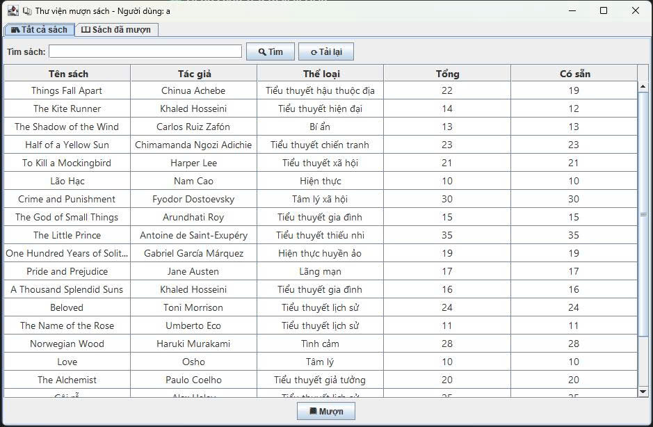
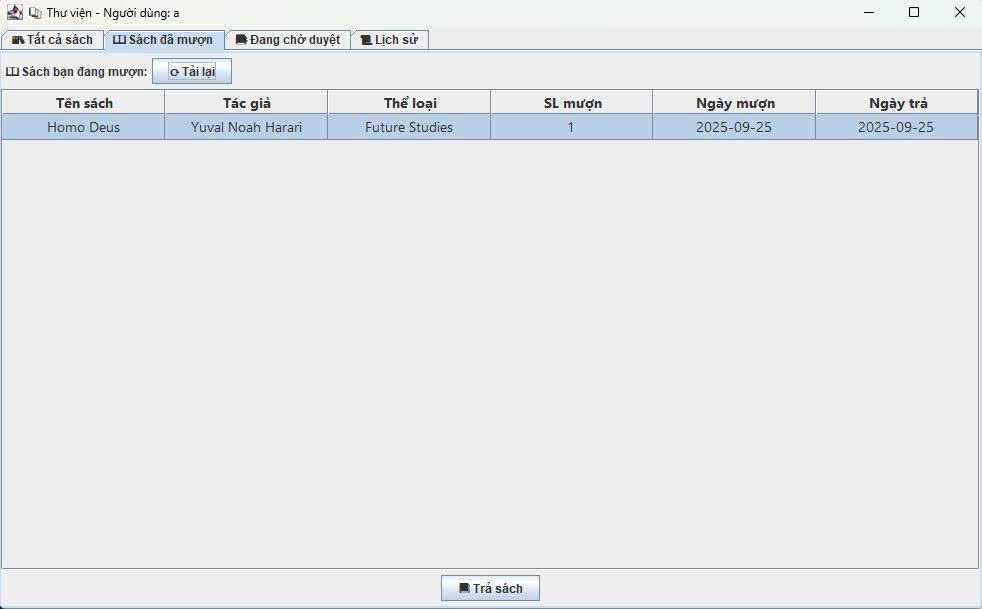
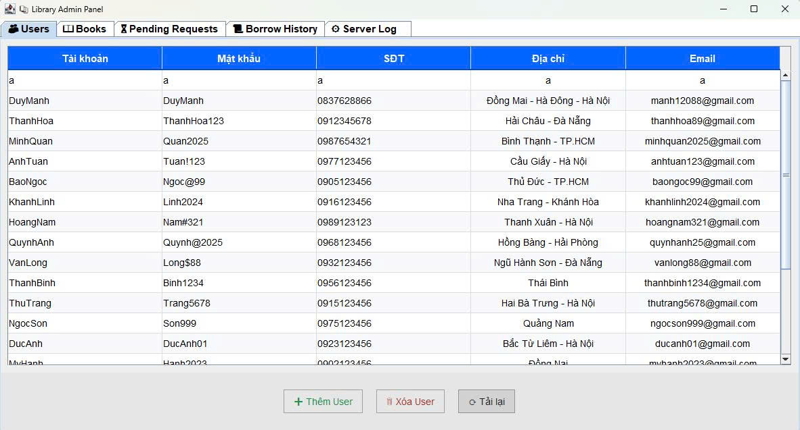
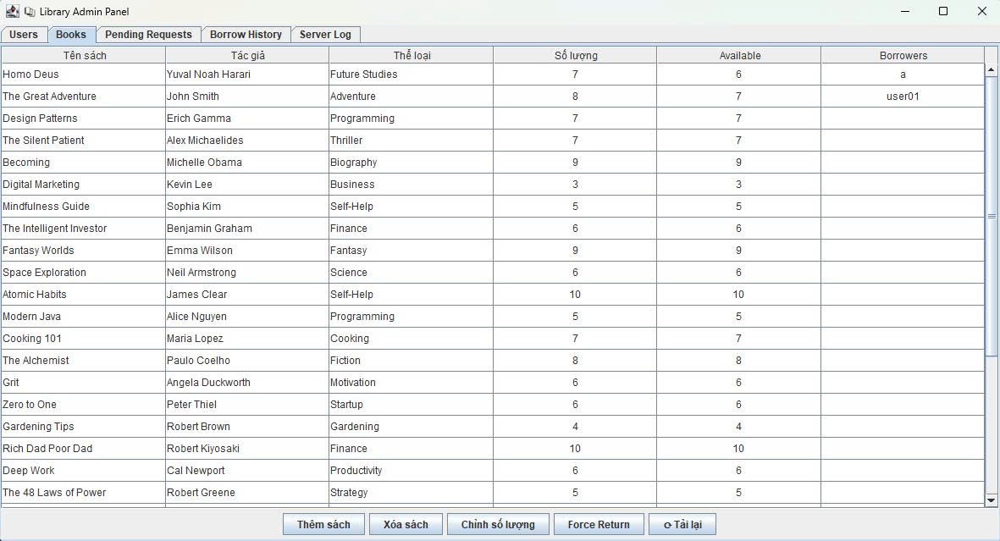

<h2 align="center">
    <a href="https://dainam.edu.vn/vi/khoa-cong-nghe-thong-tin">
    🎓  FACULTY OF INFORMATION TECHNOLOGY (DAINAM UNIVERSITY)
    </a>
</h2>
<h2 align="center">
    QUẢN LÝ SÁCH - THƯ VIỆN QUA MẠNG BẰNG GIAO THỨC TCP/IP
</h2>

    

        
        
        
    

---

## 📖 1. Giới thiệu hệ thống
Hệ thống **Quản lý sách – thư viện qua mạng** được xây dựng theo mô hình **client-server** nhằm:
- Hỗ trợ người dùng đăng ký, đăng nhập, mượn và trả sách trực tuyến.
- Cho phép quản trị viên (Admin) theo dõi, cập nhật thông tin sách, số lượng và trạng thái mượn.
- Cung cấp giao diện đơn giản nhưng đầy đủ tính năng, phục vụ nhu cầu học tập, nghiên cứu và quản lý thư viện nhỏ.

✨ Các chức năng chính:
- **Đăng nhập/Đăng ký** người dùng.
- **Server**: quản lý sách, quản lý người dùng, theo dõi ai đang mượn sách, cập nhật số lượng.
- **Client**: tìm kiếm, xem danh sách sách, mượn/trả sách.
- **Lưu trữ**: dữ liệu được lưu trữ trong các file `.txt`, thuận tiện cho cài đặt và thử nghiệm.

🎯 Mục tiêu hệ thống:
- Số hóa quản lý thư viện: thay thế phương pháp quản lý thủ công bằng một hệ thống trực tuyến, dễ sử dụng và hiện đại.
- Tối ưu trải nghiệm người dùng: hỗ trợ tìm kiếm nhanh, hiển thị trạng thái sách, theo dõi số lượng còn lại.
- Hỗ trợ quản trị viên (Admin): dễ dàng cập nhật thông tin sách, quản lý người dùng, giám sát hoạt động mượn – trả.

---

## 🔧 2. Các công nghệ được sử dụng
- **Ngôn ngữ:** Java
- **Giao diện:** Java Swing
- **Giao thức mạng:** Socket TCP/IP 
- **Lưu trữ:** File text (txt)
- **Môi trường phát triển:** Eclipse IDE
- **Hệ điều hành:** Windows

[-gray?style=for-the-badge&logo=files&logoColor=white)](#)

---

## 📷 3. Một số hình ảnh

   
  <i>Hình 1: Giao diện thư viện phía người dùng</i>

 

   
  <i>Hình 2: Danh sách sách đang được người dùng mượn</i>

 

   
  <i>Hình 3: Giao diện quản lý người dùng của Admin</i>

 

   
  <i>Hình 4: Giao diện quản lý sách của Admin</i>

---
## ⚙️ 4. Các bước cài đặt & sử dụng

### 1️⃣ Chuẩn bị môi trường
- Cài đặt **Java JDK 8+** → [Tải tại đây](https://www.oracle.com/java/technologies/javase-downloads.html)  
- Cài đặt **Eclipse IDE** .  
- Hệ điều hành: **Windows 10/11**.  

### 2️⃣ Tải source code
- Clone dự án từ GitHub:  
git clone [https://github.com/DaoDuyManh/LibraryManagementSystem.git](https://github.com/DaoDuyManh/LTM-1604-D06-QuanLyThuVien-TCP.git)
- Hoặc tải file `.zip` → giải nén.  

### 3️⃣ Import dự án vào IDE
- Mở **Eclipse IDE** → `File` → `Import` → `Existing Projects into Workspace`.  
- Chọn thư mục dự án vừa tải về.  
- Kiểm tra `Project → Properties → Java Build Path` để chắc chắn JDK đã được cấu hình đúng.  

### 4️⃣ Cấu trúc file dữ liệu
- **accounts.txt** → lưu thông tin người dùng theo định dạng:  
  username|password|phone|address|email
- **books.txt** → lưu thông tin sách:  
  title|author|category|quantity|borrower1,borrower2,...

> 📌 Lưu ý: 2 file này được server đọc & ghi trực tiếp. Khi mượn/trả sách, dữ liệu sẽ tự động cập nhật.

### 5️⃣ Chạy chương trình
- **Khởi động Server**  
  - Mở file `ServerMain.java` → Run.  
  - Server sẽ hiển thị log kết nối và quản lý dữ liệu sách + người dùng.  

- **Khởi động Client**  
  - Mở file `MainUI.java` → Run.  
  - Cửa sổ giao diện hiện ra cho phép đăng nhập, tìm kiếm, mượn & trả sách từ xa.  

### 6️⃣ Đăng nhập / Đăng ký
- **Đăng nhập**: Sử dụng tài khoản có sẵn trong `accounts.txt`.  
- **Đăng ký**: Nhấn nút **Đăng ký** trên Client để tạo tài khoản mới.  

### 7️⃣ Thao tác chính trên hệ thống
- **Tìm kiếm sách** → nhập tên/tác giả/thể loại.  
- **Mượn sách** → chọn sách → nhấn **📗 Mượn**.  
- **Trả sách** → sang tab "Sách đã mượn" → chọn sách → nhấn **📕 Trả**.  
- **Xem danh sách** → có 2 tab:  
  - `📚 Tất cả sách`: hiển thị số lượng tồn kho.  
  - `📖 Sách đã mượn`: hiển thị các sách bạn đã mượn.  

### 8️⃣ Tài khoản demo
Ví dụ trong `accounts.txt`:  
DuyManh,DuyManh,0837628866,Đồng Mai - Hà Đông - Hà Nội,manh12088@gmail.com

### 9️⃣ Kết thúc phiên làm việc
- Đóng cửa sổ **Client** để thoát.  
- Dừng **Server** (Stop trong Eclipse) → dữ liệu đã được lưu lại vào file.  

✅ Sau khi hoàn tất các bước trên, bạn đã có thể sử dụng hệ thống **Quản lý thư viện trực tuyến** với đầy đủ tính năng đăng nhập, tìm kiếm, mượn & trả sách qua mạng TCP/IP.

---

## ✉️ 5. Liên hệ cá nhân
Nếu bạn cần trao đổi thêm hoặc muốn phát triển mở rộng hệ thống, vui lòng liên hệ:  

- 👨‍💻 **Tác giả:** Đào Duy Mạnh  
- 📧 **Email:** Manh12088@gmail.com  
- 📱 **SĐT:** 0837628866  
- 🌐 **GitHub:** [github.com/DaoDuyManh](https://github.com/DaoDuyManh)  
 
© 2025 AIoTLab, Faculty of Information Technology, DaiNam University. All rights reserved.

